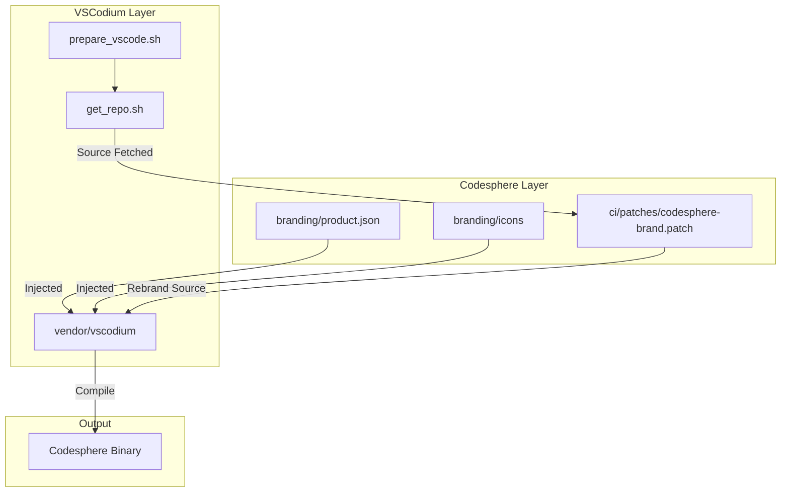

# 🏗️ Codesphere Architecture

This document describes the technical architecture and "dot-connecting" logic that transforms VSCodium into Codesphere.

## 1. The Core Philosophy: Layered Injection

Most IDE forks commit thousands of rebranded strings directly into a forked repository. This creates a "merge hell" when upstream updates. 

**Codesphere's approach is different.** We treat the IDE source as an immutable substrate and apply rebranding as a **dynamic injection layer** during the build process.

### Interaction Map

---

## 2. Component Breakdown

### 🎨 Identity Layer (`branding/`)
This is the single source of truth for the Codesphere brand. 
- **`product.json`**: Controls the application name, marketplace URLs (Open VSX), telemetry disabling, and Windows/macOS/Linux unique identifiers.
- **Icon Assets**: High-resolution `.ico`, `.icns`, and `.png` files that are overwritten directly into the source resource folders.

### 🛠️ Injection Logic (`ci/`)
- **`ci-branding.sh`**: The "Preparer". It applies the Codesphere brand patch and patches VSCodium's build scripts to preserve our changes.
- **`generate-brand-patch.sh`**: The "Patch Generator". Creates a git patch with all Codesphere branding changes (VSCodium → Codesphere replacements).
- **`patches/codesphere-brand.patch`**: The "Brand Patch". Applied during build to rebrand VSCodium source to Codesphere (aligned with VSCodium's own patch methodology).
- **`compliance-check.sh`**: The "Gatekeeper". Uses `ripgrep` to verify that no forbidden brand references (like "VSCodium") remain in the source before building.

### 📦 Platform-Specific Build Pipelines
We have split the unified build into three distinct workflows for maximum reliability:

1.  **`linux-build.yml`**: Handles x64 and ARM64 builds on Ubuntu.
2.  **`windows-build.yml`**: Uses Git Bash on Windows runners to handle the packaging of `.exe` and `.zip` artifacts, specifically resolving the `rcedit` versioning requirement.
3.  **`macos-build.yml`**: Targets macOS runners for Apple Silicon and Intel cross-compilation, ensuring correct app bundle naming and universal binary compatibility.

---

## 3. Sovereignty & Privacy Mechanics

### Extension Registry
Codesphere points directly to **Open VSX**. This means:
- No telemetry sent to Microsoft for extension discovery.
- Fully open-source marketplace logic.
- Community-governed extension publishing.

### Telemetry Elimination
Privacy is enforced through **Defense-in-Depth**:
1.  **Level 1 (Config)**: `telemetry.enableTelemetry` is explicitly set to `false` in `product.json`.
2.  **Level 2 (Source)**: The `codesphere-brand.patch` removes telemetry endpoint strings via git patch.
3.  **Level 3 (VSCodium)**: We leverage VSCodium's existing logic for stripping proprietary telemetry handlers from the core source.

---

## 4. Upstream Sync Strategy

To update Codesphere to the latest VS Code version:
1. Update matching VSCodium version: `git submodule update --remote`.
2. Regenerate the brand patch: `./ci/generate-brand-patch.sh`
3. Push to `main`.
4. The CI pipeline will automatically apply the brand patch to the new source version.
5. If the build fails the compliance check, update the branding logic in `generate-brand-patch.sh` and regenerate the patch.

---
*Last Updated: 2025-12-30*
